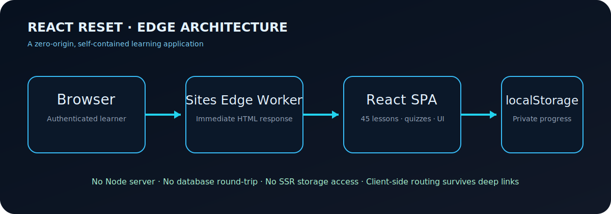

# React Reset — Prathick’s 45-Day React Journey



An interactive, visual-first React learning system designed for Prathick, a first-year B.Tech CSE student rebuilding React knowledge from fundamentals to production thinking. It combines a structured 45-day curriculum with progress tracking, daily quizzes, execution visualizers, practice gates, weak-concept review, and a final assessment.

## Why this project exists

React often feels difficult when syntax is memorized before the rendering model is understood. React Reset teaches each subject through the same repeatable chain:

`goal → reason → mental model → execution trace → syntax → examples → mistakes → practice → quiz → references`

The course starts with the JavaScript concepts React depends on, then advances through state, effects, reusable logic, architecture, real applications, performance, accessibility, testing, and production decisions.

## Product capabilities

- 45 dated lessons across eight learning phases
- Seven-question quiz per day with explanations and retry support
- Interactive render-flow visualizer and JSX playground
- Progress gates: explanation viewed, practice attempted, and quiz completed
- Dashboard with streak, completion, average score, roadmap, and weak concepts
- Quiz review for missed answers and a final assessment surface
- Export, import, and reset controls for learner-owned progress
- Responsive desktop/mobile interface with accessible semantic controls
- Deep-linkable routes such as `/day/1`, `/lessons`, and `/assessment`

## Technology

| Layer | Choice | Purpose |
|---|---|---|
| UI | React 19 + TypeScript | Component model and type-safe course experience |
| Icons | Lucide React | Consistent interface iconography |
| Development | Vite | Fast local development and static compilation |
| Testing | Vitest | Curriculum integrity and data checks |
| Quality | ESLint | React and TypeScript static analysis |
| Production | Sites edge worker | Immediate edge response with no origin server |
| Persistence | Browser `localStorage` | Private, device-local learning progress |

## Production architecture

The production build is intentionally originless. Vite compiles the React application, `scripts/build-sites.mjs` inlines its JavaScript and CSS into one HTML document, and a small module worker serves that document for every application route.

This design prevents server-rendering timeouts and makes deep links reliable. `/health` returns a lightweight JSON health response, while every UI route returns the same SPA shell and lets React select the screen in the browser.

## Local development

Requirements: Node.js 20+ and npm.

```bash
npm install
npm run dev
```

Open the local URL printed by Vite/Vinext. Progress remains in the current browser profile.

## Validation and build

```bash
npm run test
npm run lint
npm run build
```

The production command creates:

```text
dist/
├── .openai/hosting.json
└── server/index.js
```

`dist/server/index.js` is the self-contained Sites edge entrypoint. The generated bundle includes the complete application, styles, lessons, and quiz data.

## Project map

```text
app/                         Optional Vinext/Next-compatible route shell
docs/architecture.svg        System architecture artwork
scripts/build-sites.mjs      Static-to-edge packaging pipeline
src/App.tsx                  Application screens, routing, and progress logic
src/lessons.ts               Complete 45-day curriculum and quiz dataset
src/lessons.test.ts          Curriculum integrity tests
src/styles.css               Responsive visual system
src/main.tsx                 Browser entrypoint
vite.static.config.ts        Production static compiler configuration
.openai/hosting.json         Sites project metadata
```

## Learning phases

1. JavaScript Reset
2. React Fundamentals
3. Effects
4. Reusable Logic
5. Architecture
6. Real Applications
7. Production Thinking
8. Final Assessment

## Progress and privacy

Learning state is saved under `react-reset-progress-v1` in browser storage. No quiz answers or progress records are sent to a database. Export produces a JSON backup; import restores it on another browser. Clearing site data removes local progress unless it was exported first.

## Deployment notes

The Sites build must contain both `dist/server/index.js` and `dist/.openai/hosting.json`. Deploy the archive produced from the same Git commit recorded by the Sites version. The live application is owner-only unless its Sites access policy is explicitly changed.

## License

Built as a personalized educational project. Course links point to official React documentation and selected learning resources; those external materials retain their respective ownership and terms.
